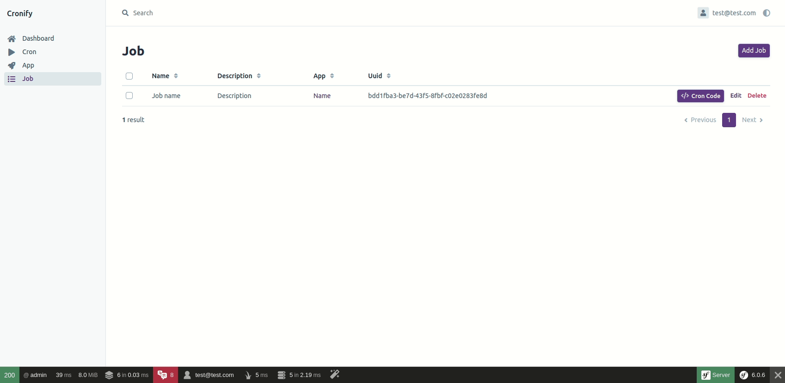

# Cronify

Simply monitor your Cron

[](https://github.com/yoanbernabeu/cronify/actions/workflows/ci.yml) [](LICENSE)


---

## Table of Contents

<!-- vscode-markdown-toc -->
* 1. [What is cronify ?](#Whatiscronify)
* 2. [How to install the app ?](#Howtoinstalltheapp)
	* 2.1. [Prerequisites](#Prerequisites)
	* 2.2. [Clone and install](#Cloneandinstall)
	* 2.3. [Create a new User](#CreateanewUser)
* 3. [How to use ?](#Howtouse)
	* 3.1. [Create a new App](#CreateanewApp)
	* 3.2. [Create a new Job](#CreateanewJob)
	* 3.3. [Get Cron Code snippet](#GetCronCodesnippet)
* 4. [License](#License)

<!-- vscode-markdown-toc-config
	numbering=true
	autoSave=true
	/vscode-markdown-toc-config -->
<!-- /vscode-markdown-toc -->

---

##  1. <a name='Whatiscronify'></a>What is cronify ?

Cronify is a simple tool to monitor the execution of your cron jobs.

The use is super simple:
1. Declare one or more applications
2. Declare one or more jobs for your applications
3. For each job, you only have to touch three addresses to log the execution:
    - An address to start a cron
    - An address to stop a cron
    - An address to indicate an error

##  2. <a name='Howtoinstalltheapp'></a>How to install the app ?

Cronify is a simple Symfony/PHP/PostgreSQL application.

This documentation offers a simplified installation FOR DEVELOPMENT ONLY with Docker. You can do without it if you already have PostgreSQL.

###  2.1. <a name='Prerequisites'></a>Prerequisites

- [PHP 8.1](https://www.php.net/downloads.php)
- [Composer](https://getcomposer.org/)
- [Docker](https://www.docker.com/)
- [Make](https://www.gnu.org/software/make/)
- [Symfony CLI](https://symfony.com/download)

###  2.2. <a name='Cloneandinstall'></a>Clone and install

```bash
git clone https://github.com/yoanbernabeu/Cronify.git
cd Cronify
make install
```

###  2.3. <a name='CreateanewUser'></a>Create a new User

User creation is possible from the command line.

```bash
symfony console app:create-user username@mail.com password
```

##  3. <a name='Howtouse'></a>How to use ?

Only THREE steps to get your cron job monitoring addresses !

###  3.1. <a name='CreateanewApp'></a>Create a new App


###  3.2. <a name='CreateanewJob'></a>Create a new Job


###  3.3. <a name='GetCronCodesnippet'></a>Get Cron Code snippet



##  4. <a name='License'></a>License

See the bundled [LICENSE](LICENCE) file.